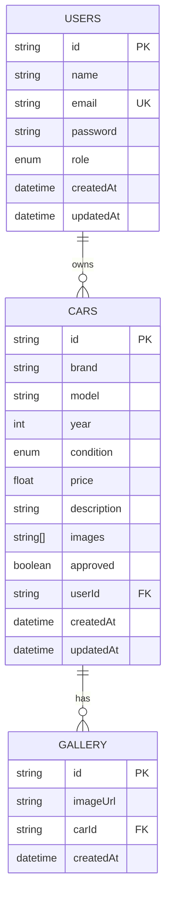

# MotoCare Database ER Diagram

## Entity Relationship Diagram



## Database Schema

### Users Table
| Column | Type | Constraints | Description |
|--------|------|-------------|-------------|
| id | string | PRIMARY KEY | Unique user identifier |
| name | string | NOT NULL | User's full name |
| email | string | UNIQUE, NOT NULL | User's email address |
| password | string | NOT NULL | Hashed password |
| role | enum | NOT NULL, DEFAULT 'USER' | User role (USER, ADMIN) |
| createdAt | datetime | NOT NULL, DEFAULT NOW() | Account creation timestamp |
| updatedAt | datetime | NOT NULL, ON UPDATE NOW() | Last update timestamp |

### Cars Table
| Column | Type | Constraints | Description |
|--------|------|-------------|-------------|
| id | string | PRIMARY KEY | Unique car identifier |
| brand | string | NOT NULL | Car brand (BMW, Mercedes, etc.) |
| model | string | NOT NULL | Car model |
| year | int | NOT NULL | Manufacturing year |
| condition | enum | NOT NULL | Car condition (NEW, RECONDITIONED, PRE_OWNED) |
| price | float | NOT NULL | Price in USD |
| description | string | NULL | Car description |
| images | string[] | NOT NULL | Array of image URLs |
| approved | boolean | NOT NULL, DEFAULT false | Admin approval status |
| userId | string | NOT NULL, FOREIGN KEY | Owner user ID |
| createdAt | datetime | NOT NULL, DEFAULT NOW() | Listing creation timestamp |
| updatedAt | datetime | NOT NULL, ON UPDATE NOW() | Last update timestamp |

### Gallery Table
| Column | Type | Constraints | Description |
|--------|------|-------------|-------------|
| id | string | PRIMARY KEY | Unique gallery image identifier |
| imageUrl | string | NOT NULL | Image file path/URL |
| carId | string | NOT NULL, FOREIGN KEY | Associated car ID |
| createdAt | datetime | NOT NULL, DEFAULT NOW() | Upload timestamp |

## Relationships

### One-to-Many: Users → Cars
- One user can own multiple cars
- Each car belongs to exactly one user
- Foreign key: `cars.userId` references `users.id`
- Cascade delete: When a user is deleted, all their cars are deleted

### One-to-Many: Cars → Gallery
- One car can have multiple gallery images
- Each gallery image belongs to exactly one car
- Foreign key: `gallery.carId` references `cars.id`
- Cascade delete: When a car is deleted, all its gallery images are deleted

## Indexes

### Primary Indexes
- `users.id` (PRIMARY KEY)
- `cars.id` (PRIMARY KEY)
- `gallery.id` (PRIMARY KEY)

### Unique Indexes
- `users.email` (UNIQUE)

### Foreign Key Indexes
- `cars.userId` (INDEX)
- `gallery.carId` (INDEX)

### Performance Indexes
- `cars.approved` (INDEX) - For filtering approved cars
- `cars.brand` (INDEX) - For brand filtering
- `cars.condition` (INDEX) - For condition filtering
- `cars.price` (INDEX) - For price range filtering
- `cars.year` (INDEX) - For year filtering
- `cars.createdAt` (INDEX) - For sorting by date

## Data Types

### Enums

#### User Role
- `USER` - Regular user
- `ADMIN` - Administrator

#### Car Condition
- `NEW` - Brand new vehicle
- `RECONDITIONED` - Professionally restored
- `PRE_OWNED` - Used vehicle

## Constraints

### Check Constraints
- `cars.year` >= 1900 AND <= current_year + 1
- `cars.price` >= 0
- `users.name` length >= 2
- `users.email` valid email format
- `users.password` length >= 6

### Not Null Constraints
- All primary keys
- All foreign keys
- `users.name`, `users.email`, `users.password`
- `cars.brand`, `cars.model`, `cars.year`, `cars.condition`, `cars.price`
- `gallery.imageUrl`, `gallery.carId`

## Sample Data

### Users
```sql
INSERT INTO users (id, name, email, password, role) VALUES
('user1', 'John Doe', 'john@example.com', '$2a$10$...', 'USER'),
('user2', 'Admin User', 'admin@motocare.com', '$2a$10$...', 'ADMIN');
```

### Cars
```sql
INSERT INTO cars (id, brand, model, year, condition, price, description, images, approved, userId) VALUES
('car1', 'BMW', 'X5', 2023, 'NEW', 75000, 'Luxury SUV...', ['/uploads/bmw1.jpg'], true, 'user1'),
('car2', 'Mercedes-Benz', 'C-Class', 2022, 'RECONDITIONED', 45000, 'Elegant sedan...', ['/uploads/mercedes1.jpg'], true, 'user1');
```

### Gallery
```sql
INSERT INTO gallery (id, imageUrl, carId) VALUES
('gallery1', '/uploads/gallery1.jpg', 'car1'),
('gallery2', '/uploads/gallery2.jpg', 'car1');
```
